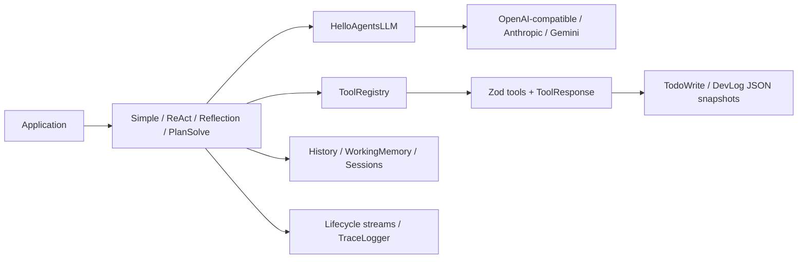

# Architecture

The package maps Python V1 concepts into a portable TypeScript ESM design.
All public asynchronous work uses `Promise`, `AsyncIterable`, and
`AbortSignal`, so the built package runs unchanged on Bun and Node.js 22/24.

The repository uses `hello_agents/` as its TypeScript source root, matching the
top-level package directory in both upstream implementations. Internal TypeScript
filenames retain kebab-case where appropriate, while the package hierarchy now
aligns one-to-one with Python and Go. The published `dist` entry point and npm
exports remain unchanged.

- Zod is the input authority for every public tool. Its JSON Schema becomes
  the Function Calling declaration exposed to providers.
- Providers are normalized at the adapter boundary. Tool-call arguments remain
  JSON strings to preserve the Python wire contract.
- `ToolResponse` turns model-facing failures into structured data rather than
  process errors.
- Session, todo, and development-log writes use temporary files plus rename;
  the durable tools additionally serialize local mutations to prevent corrupt
  JSON during concurrent calls.
- `TraceLogger` is runtime observability. `DevLogTool` is deliberately a
  separate journal for decisions and handoff context.
